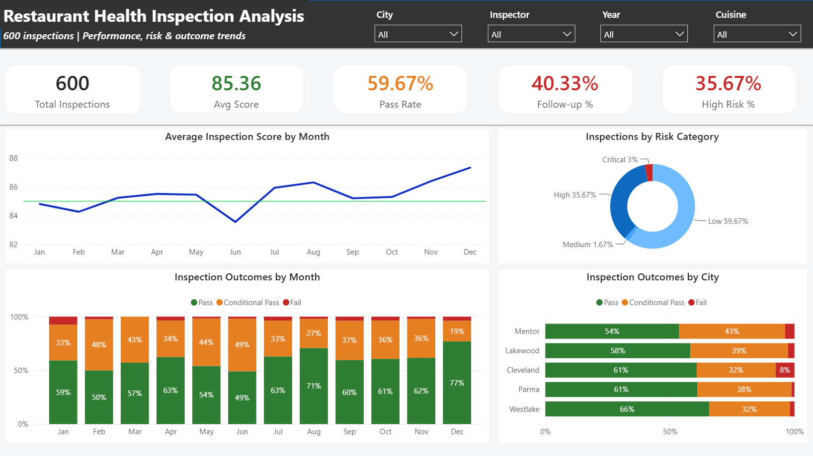

# restaurant-health-inspection-analysis
Analyzed 600 restaurant health inspections in Power BI to evaluate inspection performance, pass rates, follow-up inspections, and risk levels. The dashboard allows users to explore results across cities, cuisines, years, and inspectors to identify patterns in restaurant health and safety performance.

## Dashboard

## Project Overview

This project analyzes restaurant health inspection data to better understand inspection performance, identify patterns in violations, and highlight areas of potential risk. I completed the project independently from data preparation through analysis and dashboard development, with the goal of turning raw inspection data into clear and useful insights.

## Tools Used

- **Power BI** – Dashboard development and data visualization
- **Power Query** – Data cleaning and transformation
- **DAX** – Calculated measures and KPIs

## Data Preparation

The dataset was cleaned and prepared in Power Query before analysis. This included reviewing data types, handling missing or inconsistent values, and preparing the inspection data for use in the dashboard. I also created calculated measures in DAX to track metrics such as total inspections, average inspection score, pass rate, follow-up rate, and restaurant risk levels.
